# Election_Analysis

## Project Overview
A Colorado Board of Elections employee gave me the task of doing an election audit for a recent local congressional election. The following is a list of the initial requirements:

1. Calculate the total number of votes cast.

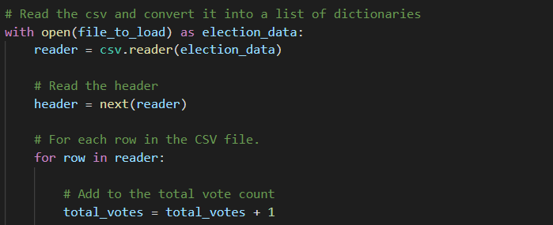

2. Get a complete list of candidates who recieved votes.

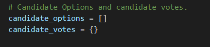

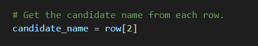

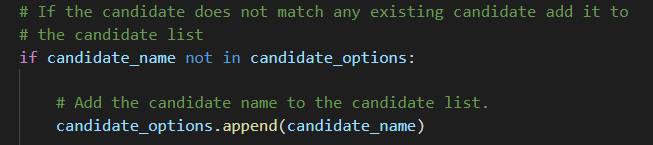

3. Calculate the total number of votes each candidate recieved.

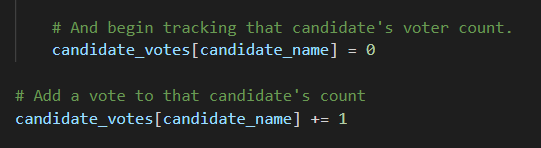

4. Calculate the percentage of votes each candidate won.

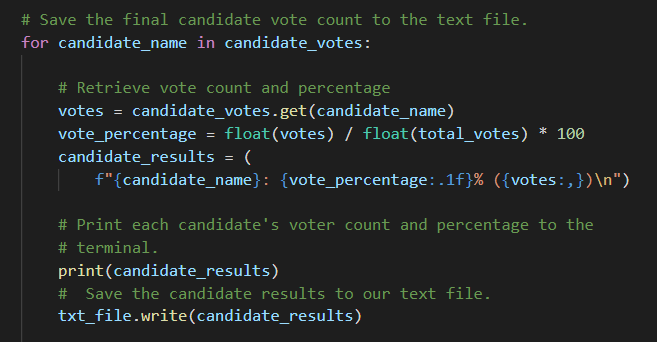

5. Determine the winner of the electiopn based on popular vote.

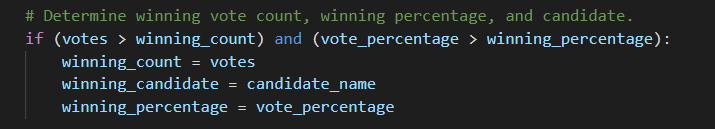

## Resources
- Data Source: election_results.csv
- Software: Python 3.6.1, Visual Studio Code, 1.38.1

## Summary
The analysis of the election shows that:
- There were "369,711" votes cast in the election.

- The candidates were:
    - Charles Casper Stockham
    - Diana DeGette
    - Raymon Anthony Doanne
- The candidate results were:
    - Charles Casper Stockham recieved "23%" of the vote and "85,213" number of votes.
    - Diana DeGette recieved "73.8%" of the vote and "272,892" number of votes.
    - Raymon Anthony Doanne recieved "3.1%" of the vote and "11,606" number of votes.
- The winner of the election was:
    - Diana DeGette, who recieved "73.8%" of the vote and "272,892" number of votes.

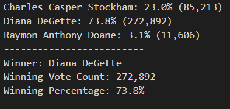

## Challenge Overview
The Colorado Board of Elections was thrilled with the code I wrote to get the outcome of the election. Now they wanted me to do an analysis on how the counties voted. There's three counties that were involved in the election (Jefferson, Denver, and Arapahoe). The following is a list of the requirements that they wanted:

1. The voter turnout for each county.

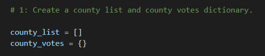

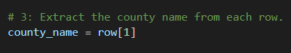

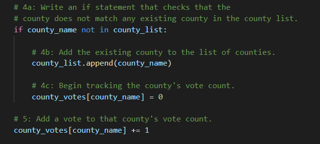

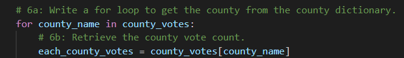

2. The percentage of votes from each county out of the total count.

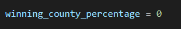

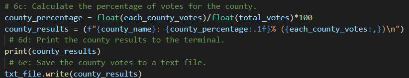

3. The county with the highest turnout.

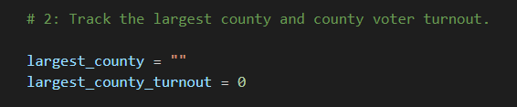

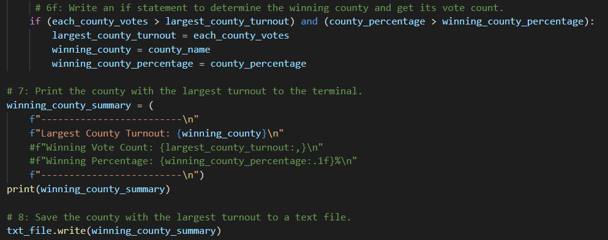

## Challenge Summary
The analysis of the counties shows that:
- The largest turnout winner was Denver
    - Jefferson had 10.5% of all votes, which amounts to 38,855 votes
    - Denver had 82.8% of all votes, which amounts to 306,055 votes
    - Arapahoe had 6.7% of all votes, which amounts to 24,801 votes

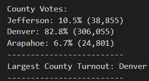

Dear election commission, feel free to reuse this code for future elections! This code should work as long as your workspace in VS Code is properly organized with the dataset (.csv) you're working with and your Python code file. You need to have a main folder that contains everything. Then within that file you need to have your .py file, another folder called "Resources", and another folder called "analysis". Put your data set within the "Resources" folder, that way the code can properly pull data from it. Another thing you're going to need to do is make sure the dataset (your .csv) file is structured the same. Make sure counties is in column B and candidates is in column C. And then it should work! 